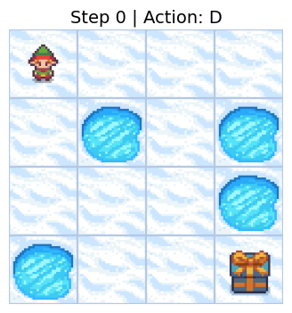
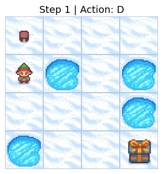
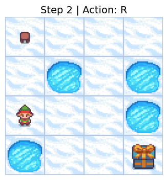

# FrozenLake Q-Learning Agent

A simple Q-learning implementation for the **FrozenLake-v1** environment from Gymnasium.

## 📦 Requirements

```bash
pip install -r requirements.txt
```

## ▶️ Training

```bash
python train.py
```
Saves the trained Q-table to models/frozenlake_q_table.npy.

## 🔍 Evaluation (with rendering)

```bash
python evaluate.py
```

## 🎞️ Visualization (save frames)

```bash
python visualize.py
```
Outputs PNG frames to frozenlake_frames/.

## 🧠 Algorithm

- **Algorithm**: Q-learning
- **Exploration**: ε-greedy with exponential decay
- **Environment**: `FrozenLake-v1` (`is_slippery=False`)
- **Goal**: Learn optimal path from Start (S) to Goal (G) avoiding Holes (H)

## 📁 Project Structure

- `config.yaml`: Hyperparameters
- `models/`: Trained Q-table
- `frozenlake_frames/`: Visualization output

> ✅ Converges to >0.95 average reward in ~200 episodes.

## 🎥 Demo

Trained agent successfully navigating the FrozenLake:
```html
<table>
  <tr>
    <td></td>
    <td></td>
    <td></td>
  </tr>
</table>
```
